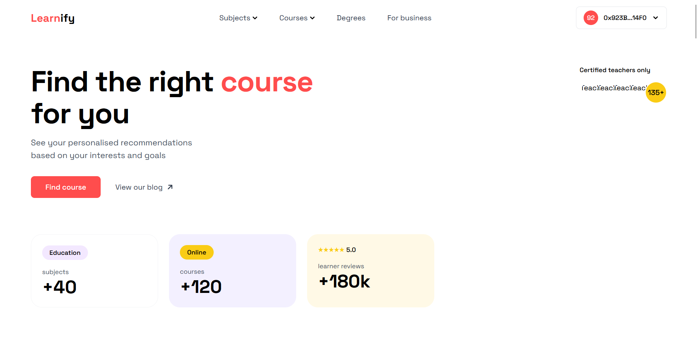

# Learnify - Interactive Learning Platform

A visually stunning educational platform that brings learning to life through interactive experiences and real-time engagement.



## ✨ Interactive Features

- 🎨 Dynamic Dashboard with Real-time Updates
- 📊 Interactive Progress Visualizations
- 🎯 Gamified Learning Experience
- 📱 Responsive & Modern UI/UX
- 🎮 Interactive Quizzes & Assessments
- 📅 Visual Timetable & Schedule
- 🎨 Custom Course Illustrations
- 📈 Progress Tracking Charts
- 🎭 Interactive Course Content
- 🎨 Beautiful Course Cards & UI Elements

## 🎨 Visual Components

- Custom SVG Illustrations for Each Course
- Animated Progress Indicators
- Interactive Course Cards
- Dynamic Color Schemes
- Responsive Grid Layouts
- Modern UI Components
- Beautiful Typography
- Smooth Animations & Transitions

## 🛠️ Tech Stack

- React + TypeScript
- TailwindCSS for Styling
- Framer Motion for Animations
- Ethers.js for Blockchain
- Web3Auth for Authentication
- LocalStorage for Data

## 🚀 Getting Started

1. Clone the repository:
```bash
git clone https://github.com/Mayforhern/learnify.git
cd learnify
```

2. Install dependencies:
```bash
npm install
```

3. Set up environment variables:
```bash
cp .env.example .env
# Add your contract address and other required variables
```

4. Start the development server:
```bash
npm run dev
```

## 🎯 Interactive Features Demo

- **Dashboard**: Real-time progress tracking with beautiful visualizations
- **Course Cards**: Interactive cards with hover effects and animations
- **Progress Tracking**: Visual progress indicators and achievement badges
- **Timetable**: Interactive calendar with drag-and-drop functionality
- **Assessments**: Engaging quiz interface with immediate feedback

## 🤝 Contributing

Contributions are welcome! Please feel free to submit a Pull Request.

## 📄 License

MIT License - feel free to use this project for your own purposes.

## 🎨 Screenshots

### Platform Overview


### Interactive Dashboard
[Coming Soon - Add dashboard screenshot]

### Course Interface
[Coming Soon - Add course interface screenshot]
